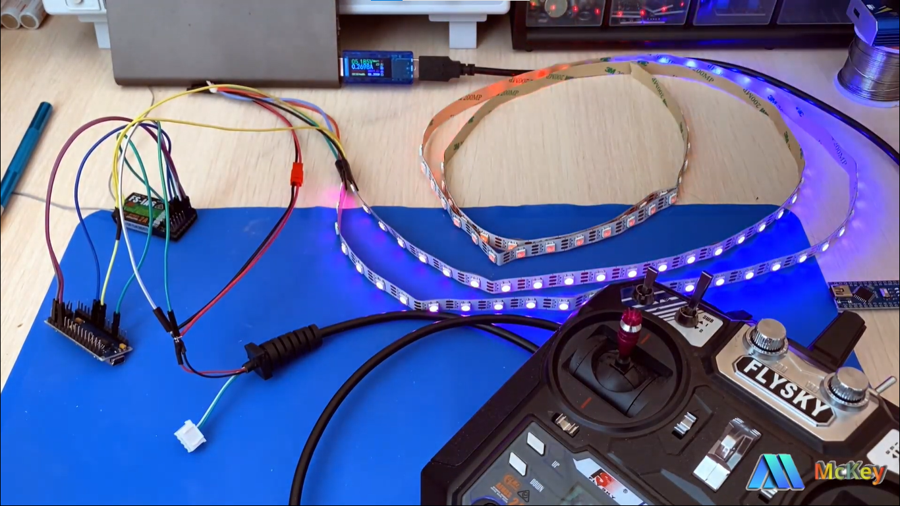

#         Lighting-for-RC-models-on-WS2812b
Project of lighting and some lighting effects for RC model.
For the project, you will need an arduino nano and a ws2812b-based tape.
An example of the work on my channel https://youtu.be/oXqDV9sT4F8

Проект  освещения и некоторых эффектов освещения для RC модели.
Для проекта понадобится arduino nano и лента на базе WS2812b.
Пример работы у меня на канале https://youtu.be/oXqDV9sT4F8 

